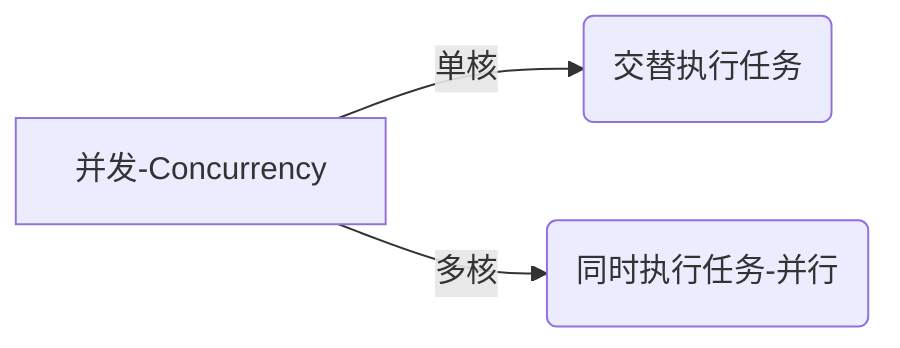

## **Goroutine：轻量级线程**

```go
func say(s string) {
    for i := 0; i < 3; i++ {
        time.Sleep(100 * time.Millisecond)
        fmt.Println(s)
    }
}

func main() {
    go say("world") // 启动Goroutine
    say("hello")    // 主Goroutine
}
```

**特性**：

- **开销极小**：初始仅2KB栈，动态扩容（线程一般是MB级开销）
- **调度优化**：GMP模型避免OS线程频繁切换
- **简单创建**：只需`go`关键字

### **并发 vs 并行**



## **Channel：安全的通信管道**

### **基本操作**

```go
ch := make(chan int, 3) // 创建缓冲通道（容量3）

// 发送数据
ch <- 1
ch <- 2

// 接收数据
fmt.Println(<-ch) // 1
fmt.Println(<-ch) // 2

close(ch)         // 关闭通道
```

> 如果发送的数据满了，则发送数据的Goroutine会阻塞直到channel的数据被接收

### **通道类型对比**

|    类型    |        示例         |          特性          |
| :--------: | :-----------------: | :--------------------: |
| 无缓冲通道 |  `make(chan int)`   | 同步阻塞，确保直接通信 |
| 有缓冲通道 | `make(chan int, N)` | 异步队列，解耦生产消费 |

### **经典模式**

#### **生产者-消费者**

```go
func producer(ch chan<- int) {
    for i := 0; i < 5; i++ {
        ch <- i
    }
    close(ch)
}

func consumer(ch <-chan int) {
    for num := range ch {
        fmt.Println("Received:", num)
    }
}

func main() {
    ch := make(chan int, 2)
    go producer(ch)
    consumer(ch)
}
```

输出：

```bash
Received: 0
Received: 1
Received: 2
Received: 3
Received: 4
```

> 注意参数的区别  `chan<-`  这个是发送者，`<-chan`  这个是接收者

#### **工作池（Worker Pool）**

```go
func worker(id int, jobs <-chan int, results chan<- int) {
    for j := range jobs {
        fmt.Printf("Worker%d processing job%d\n", id, j)
        results <- j * 2
    }
}

func main() {
    jobs := make(chan int, 10)
    results := make(chan int, 10)

    // 启动3个worker
    for w := 1; w <= 3; w++ {
        go worker(w, jobs, results)
    }

    // 发送9个任务
    for j := 1; j <= 9; j++ {
        jobs <- j
    }
    close(jobs)

    // 获取结果
    for r := 1; r <= 9; r++ {
        <-results
    }
}
```

输出：

```bash
Worker2 processing job2
Worker2 processing job4
Worker2 processing job5
Worker2 processing job6
Worker2 processing job7
Worker2 processing job8
Worker2 processing job9
Worker3 processing job3
Worker1 processing job1
```

## **同步原语：sync**

### **WaitGroup：等待一组Goroutine**

```go
var wg sync.WaitGroup

for i := 0; i < 5; i++ {
    wg.Add(1) // 计数器+1
    go func(id int) {
        defer wg.Done() // 计数器-1
        fmt.Println(id)
    }(i)
}

wg.Wait() // 阻塞直到计数器归零
```

### **Mutex：保护共享资源**

```go
var (
    counter int
    mu      sync.Mutex
)

func safeIncrement() {
    mu.Lock()
    defer mu.Unlock() // 建议加锁之后写这句，防止后面操作完成后忘记解锁
    counter++
}
```

## **实战：并发爬虫设计**

**需求**：并发抓取多个URL，限制最大并发数

示例代码：

```go
func crawl(url string, sem chan int, wg *sync.WaitGroup) {
	defer wg.Done()

	sem <- 1                 // 获取信号量
	defer func() { <-sem }() // 释放信号量

	// 模拟抓取
	fmt.Printf("Crawling %s\n", url)
	time.Sleep(1 * time.Second)
}

func main() {
	urls := []string{"url1", "url2", "url3", "url4", "url5"}
	sem := make(chan int, 2) // 并发限制为2
	var wg sync.WaitGroup

	for _, url := range urls {
		wg.Add(1)
		go crawl(url, sem, &wg)
	}

	wg.Wait()
}
```

## **避坑指南**

### **常见问题**

1. **通道死锁**：无缓冲通道未配对使用

   ```go
   ch := make(chan int)
   ch <- 1  // 阻塞（无接收者），除非在这之前启动一个协程来接收
   ```

2. **Goroutine泄漏**：忘记关闭通道或取消上下文

   ```go
   // 错误示例
   go func() {
       for {
           time.Sleep(time.Second) // 永不退出
       }
   }()
   ```

### **调试技巧**

```go
// 查看当前Goroutine数量
import "runtime"
fmt.Println(runtime.NumGoroutine())

// 使用pprof监控
import _ "net/http/pprof"
go http.ListenAndServe(":6060", nil)
```
